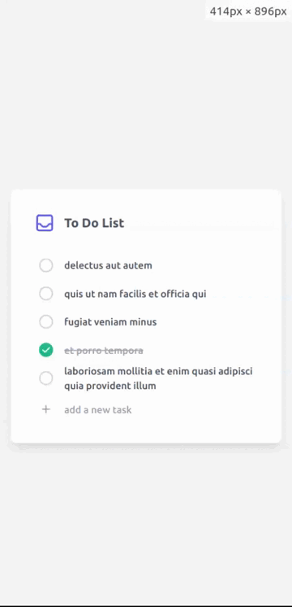

## Description

This project showcases a simple todo application built using Angular 17 and NgRx Signal Store. It demonstrates how to effectively manage state using Signals in an Angular application. Key features include:

- NgRx Signal Store: Leverages NgRx Signal Store for state management, offering a lightweight and reactive approach.
- Todo CRU Operations: Supports creating, reading, updating status of todo items.
- Signal-Driven State Updates: Uses Signals for seamless state updates and UI reactivity.
## Getting Started

##### Demo:

This project was generated with [Angular CLI](https://github.com/angular/angular-cli) version 17.1.0.

##### Prerequisites:

- Node.js and npm (or yarn)
- Angular CLI

###### Clone the Repository:
`git clone https://github.com/vc-rakesh/ngrx-signal-demo.git`

###### Install Dependencies:

`cd angular-17-todo-ngrx-signal`
`npm install`

###### Run the Application:
`ng serve`

###### Access the Application:
Open `http://localhost:4200` in your browser.

## Key Features

- NgRx Signal Store: Implements state management using NgRx Signal Store, exploring its benefits and usage patterns.
- Todo Management: Demonstrates CRU operations for managing todo items.
Reactive UI: Leverages Signals to achieve reactive UI updates based on state changes.

## Contributions

Feel free to contribute to the project! Fork the repository, make your changes, and submit a pull request.

## License
This project is licensed under the MIT License.

## Additional Information

- Signal Store Implementation: Describes how Signal Store is configured and used in the application.
- Action Creators and Effects: Explains how actions and effects are implemented to handle state updates.
- Component Integration: Details how components interact with the Signal Store to access and update state.
